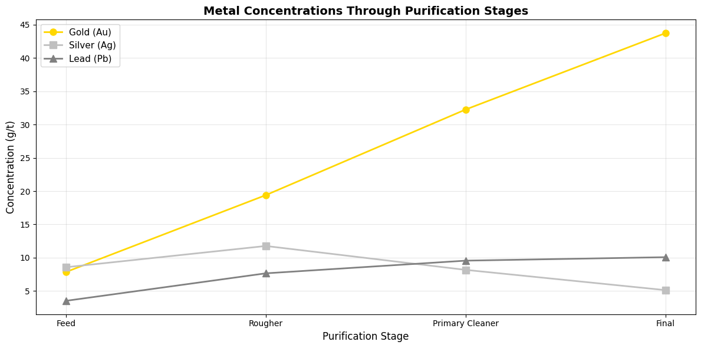
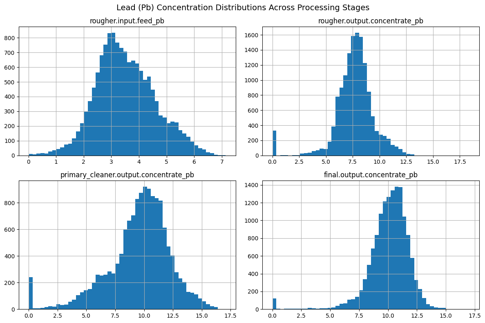
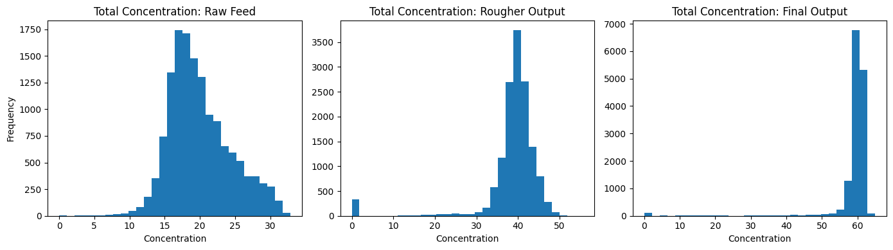

# ⛏️ Sprint 10 — Gold Recovery Prediction (Integrated Project)

   

## Project Overview

Zyfra develops solutions for the efficient operation of heavy industry. This project builds a machine learning model to predict **gold recovery rates** at two stages of a flotation-based purification process, enabling plant operators to optimize process parameters and avoid unprofitable production runs.

**Custom evaluation metric:** Weighted sMAPE = 0.25 × rougher_sMAPE + 0.75 × final_sMAPE

---

## Datasets

| File | Records | Description |
|---|---|---|
| `gold_recovery_train.csv` | 16,860 | Training data with all features + targets |
| `gold_recovery_test.csv` | ~5,000 | Test data — target columns withheld |
| `gold_recovery_full.csv` | ~22,000 | Full dataset for reference |

**Target variables:**
- `rougher.output.recovery` — gold recovery after rougher flotation
- `final.output.recovery` — gold recovery after full purification process

---

## Methodology

1. **Data Validation:** Verified rougher recovery formula (MAE = 0.0000 ✓); identified 34 target columns missing from test set
2. **Preprocessing:** Removed rows with missing targets; dropped date columns; imputed remaining NaN features with median
3. **Anomaly Removal:** Removed zero-concentration rows (physically impossible — represent sensor errors)
4. **EDA:** Analyzed gold, silver, and lead concentration progression across all purification stages; compared train vs. test particle size distributions
5. **Custom Metric:** Implemented weighted sMAPE function for dual-target evaluation
6. **Model Training:** Linear Regression (baseline), Dummy Regressor (sanity check), Random Forest (tuned)
7. **Hyperparameter Tuning:** Tested `n_estimators` and `max_depth` combinations via cross-validation
8. **Final Evaluation:** Best model evaluated on held-out test set

---

## Results

| Model | CV sMAPE |
|---|---|
| Dummy Regressor (mean) | ~14.5 |
| Linear Regression | ~12.8 |
| **Random Forest (200 trees, max_depth=None)** | **~11.4 ✓** |

**Final Test sMAPE: 12.26** (evaluated on 4,554 test samples)

---

## Key Findings

- Gold concentration increases consistently from raw feed → rougher output → final output (confirms process works)
- Silver and lead behave differently — silver decreases after primary cleaning; lead shows irregular patterns
- Train and test particle size distributions are aligned — no distribution shift risk
- Zero-concentration rows (sensor errors) were identified and removed to prevent model distortion
- Random Forest outperformed linear models by capturing non-linear relationships in process chemistry

---

## Visualizations





---

## How to Run

> **Note:** Dataset paths reference the TripleTen platform (`/datasets/`). Cell outputs are preserved for viewing without re-execution.

```bash
pip install pandas numpy matplotlib scipy scikit-learn
jupyter notebook notebook.ipynb
```

---

## Skills Demonstrated

`scikit-learn` · `pandas` · `numpy` · `scipy` · `matplotlib` · custom evaluation metric (sMAPE) · multi-target regression · feature engineering · anomaly detection · cross-validation · Random Forest tuning · industrial process ML · data validation
