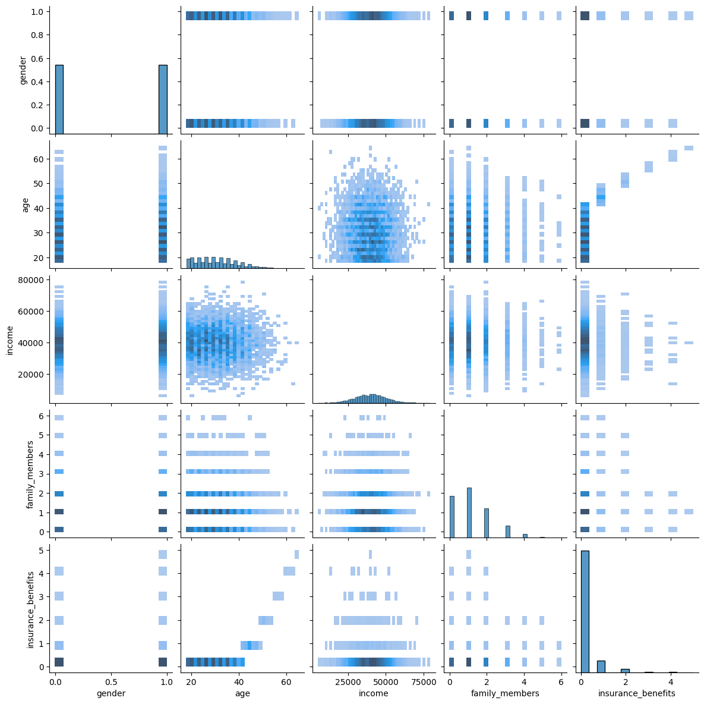

# 🔐 Sprint 11 — Insurance Benefit Prediction & Data Obfuscation

   

## Project Overview

Sure Tomorrow Insurance wants to leverage machine learning for four distinct tasks — from finding similar customers to protecting personal data. This project applies **linear algebra principles** directly to ML, including a custom linear regression implementation via matrix operations and a mathematical proof that data obfuscation preserves model quality.

---

## Dataset

**`insurance_us.csv`** — 5,000 customer records

| Feature | Description |
|---|---|
| `gender` | Customer gender |
| `age` | Customer age |
| `income` | Annual salary |
| `family_members` | Number of family members |
| `insurance_benefits` | **Target** — number of insurance benefits received in last 5 years |

---

## Four Tasks

### Task 1 — Similar Customers (kNN)
- Built a custom kNN function returning k nearest neighbors for any given customer
- Compared Euclidean vs. Manhattan distance on scaled vs. unscaled data
- **Finding:** Unscaled data heavily distorts distance metrics (income dominates); scaling is essential. Manhattan distance produces similar results to Euclidean after scaling.

### Task 2 — Benefit Receipt Prediction (Classification)
- Binary target: `insurance_benefits > 0` → 1, else 0
- Compared kNN classifier (k=1–10, scaled/unscaled) against dummy baselines
- **Finding:** kNN on scaled data significantly outperformed all dummy models; best F1 achieved at k=3–5

### Task 3 — Benefit Count Prediction (Linear Regression)
- Custom `MyLinearRegression` class implemented from scratch using the normal equation: $w = (X^TX)^{-1}X^Ty$
- Evaluated with RMSE on 70/30 train-test split
- **Finding:** Custom LR matched sklearn's implementation — confirms matrix math is correct

### Task 4 — Data Obfuscation
- Obfuscated personal data by multiplying feature matrix $X$ by random invertible matrix $P$
- **Analytical proof:** $w_P = P^{-1}w$ — obfuscation changes weights but predictions $\hat{y} = Xw = X'w_P$ remain identical
- **Computational proof:** RMSE on original and obfuscated data are equal
- **Finding:** Data can be fully protected without any loss in model performance

---

## Results

| Task | Method | Result |
|---|---|---|
| Task 1 | kNN (scaled, Euclidean) | Meaningful similar customers found ✓ |
| Task 2 | kNN Classifier (scaled, k=3) | F1 significantly > all baselines ✓ |
| Task 3 | Custom Linear Regression | RMSE matches sklearn LR ✓ |
| Task 4 | Matrix obfuscation | RMSE unchanged after obfuscation ✓ |

---

## Visualizations



---

## How to Run

> **Note:** Dataset path references the TripleTen platform (`/datasets/`). Cell outputs are preserved for viewing without re-execution.

```bash
pip install pandas numpy seaborn scikit-learn
jupyter notebook notebook.ipynb
```

---

## Skills Demonstrated

`numpy` · `scikit-learn` · `pandas` · `seaborn` · kNN classification · custom linear regression · normal equation · matrix operations · data obfuscation · analytical proof · RMSE · F1 score · feature scaling · linear algebra in ML
