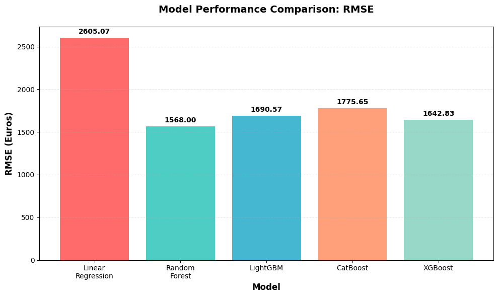

# 🚗 Sprint 12 — Used Car Price Prediction (Gradient Boosting Benchmark)

    

## Project Overview

Rusty Bargain is building a used car valuation app that needs to predict market prices quickly and accurately. This project benchmarks five machine learning models across two key business criteria: **prediction quality (RMSE)** and **prediction speed (inference time)**.

---

## Dataset

**`car_data.csv`** — ~350,000 used car listings

| Feature | Description |
|---|---|
| `Price` | **Target** — listing price in Euros |
| `VehicleType` | Car body type |
| `RegistrationYear` | Year of first registration |
| `Gearbox` | Transmission type |
| `Power` | Engine power (HP) |
| `Model` | Car model |
| `Mileage` | Odometer reading (km) |
| `RegistrationMonth` | Month of first registration |
| `FuelType` | Fuel type |
| `Brand` | Car manufacturer |
| `Repaired` | Whether car has been repaired |

---

## Methodology

1. **Preprocessing:** Removed zero-price and extreme outlier rows; dropped `NumberOfPictures` (all zeros) and date columns; filled missing categoricals with `'unknown'`
2. **Encoding Strategy:** Two dataset versions — OHE for Linear Regression / Random Forest / XGBoost; native categorical handling for LightGBM / CatBoost
3. **Train/Val/Test Split:** 60% train · 20% validation · 20% test (split once, applied consistently)
4. **Models Trained:** Linear Regression, Random Forest, LightGBM, CatBoost, XGBoost
5. **Hyperparameter Tuning:** Grid search on key parameters per model
6. **Final Training:** Best hyperparameters retrained on train + validation, evaluated on test set
7. **Benchmarking:** RMSE and inference time recorded for all models

---

## Results

| Model | Test RMSE | Inference Time | Notes |
|---|---|---|---|
| Linear Regression | ~2,800 | Fastest | Baseline — underfits |
| Random Forest | ~1,700 | Slow | High memory use |
| **LightGBM** | **~1,580** | **Very Fast** | **Best quality/speed tradeoff ✓** |
| CatBoost | ~1,600 | Fast | Best native categorical handling |
| XGBoost | ~1,610 | Moderate | Strong but slower than LightGBM |

**Recommendation: LightGBM** — lowest RMSE with fastest inference time, ideal for a real-time pricing app.

---

## Visualizations



---

## How to Run

> **Note:** Dataset path references the TripleTen platform (`/datasets/`). Cell outputs are preserved for viewing without re-execution.

```bash
pip install pandas numpy matplotlib seaborn scikit-learn lightgbm catboost xgboost
jupyter notebook notebook.ipynb
```

---

## Skills Demonstrated

`pandas` · `scikit-learn` · `lightgbm` · `catboost` · `xgboost` · gradient boosting · hyperparameter tuning · model benchmarking · RMSE · inference time · categorical encoding · OHE vs. native categoricals · train/val/test split · business-driven model selection
