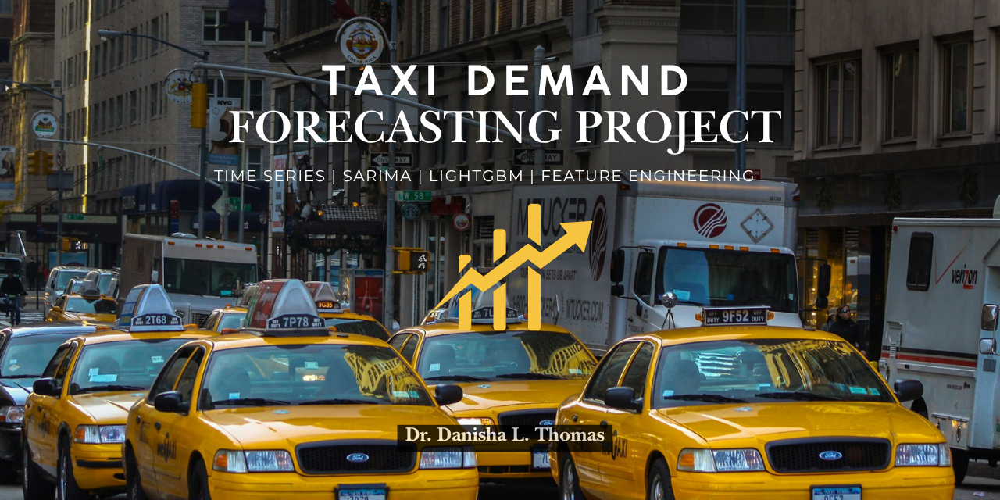
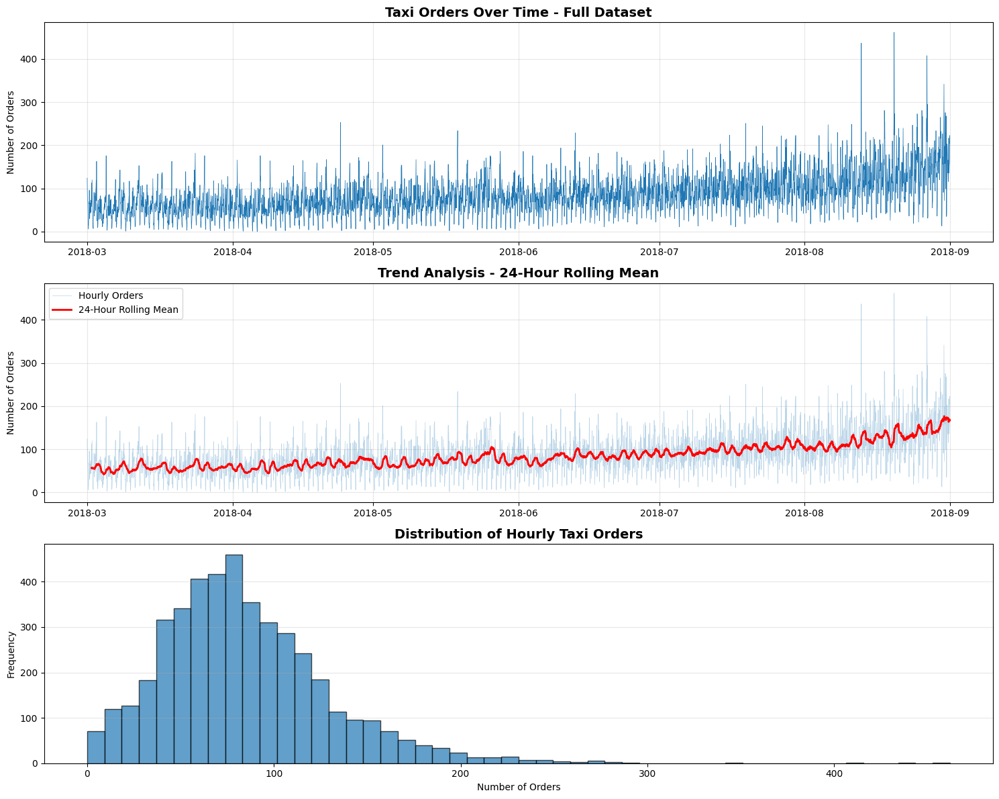
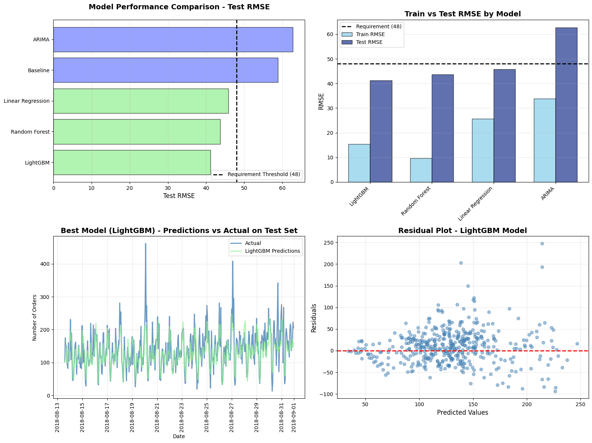

# 🚕 Sprint 13 — Taxi Order Demand Forecasting (Time Series)

   

## Project Overview

Sweet Lift Taxi needs to predict hourly taxi order demand at airports to ensure enough drivers are available during peak periods. This project applies time series forecasting techniques — engineering lag and rolling window features, then benchmarking five models against a naive persistence baseline.

**Business target: RMSE ≤ 48**

---

## Dataset

**`taxi.csv`** — Hourly taxi order counts (March–August 2018)

| Feature | Description |
|---|---|
| `datetime` | Timestamp (index) |
| `num_orders` | **Target** — number of taxi orders per hour |

---

## Methodology

1. **Preprocessing:** Loaded with datetime index; resampled to 1-hour intervals; verified no missing values
2. **EDA:** Visualized hourly volatility, weekly seasonality, and upward trend across the full period
3. **Feature Engineering:** Created 31 features — hour, day of week, month, lag features (1–24 hours), rolling mean/std (3, 6, 12, 24-hour windows)
4. **Train/Test Split:** 90% train · 10% test — **chronological split** (no shuffling — preserves time order)
5. **Models:** Persistence baseline, Linear Regression, Random Forest (GridSearchCV), ARIMA (auto_arima), LightGBM (GridSearchCV)
6. **Evaluation:** RMSE on held-out test set for all models

---

## Results

| Model | Test RMSE | Meets Target |
|---|---|---|
| Persistence Baseline (lag-1) | ~59.8 | ✗ |
| ARIMA (0,1,1) | ~62.8 | ✗ |
| Linear Regression | ~45.8 | ✓ |
| Random Forest (tuned) | ~43.5 | ✓ |
| **LightGBM (tuned)** | **~41.2** | **✓ Best** |

**Recommendation: LightGBM** — lowest RMSE, fastest inference, best quality/speed tradeoff for real-time deployment.

---

## Key Findings

- Clear upward trend and weekly seasonality visible in raw data — peak demand on weekends and late nights
- Lag features (especially lag_1 and lag_24) are the strongest predictors — orders are highly autocorrelated
- ARIMA underperformed ML models — the nonlinear patterns in this data exceed ARIMA's linear assumptions
- LightGBM's native handling of tabular features with gradient boosting captured the complex temporal patterns best

---

## Visualizations




---

## How to Run

> **Note:** Dataset path references the TripleTen platform (`/datasets/`). Cell outputs are preserved for viewing without re-execution.

```bash
pip install pandas numpy matplotlib seaborn scikit-learn lightgbm pmdarima
jupyter notebook notebook.ipynb
```

---

## Skills Demonstrated

`pandas` · `numpy` · `lightgbm` · `scikit-learn` · `pmdarima` · time series forecasting · lag feature engineering · rolling window features · chronological train/test split · ARIMA · persistence baseline · GridSearchCV · RMSE · seasonality analysis · demand forecasting
