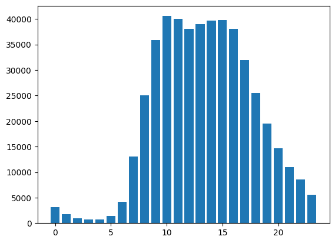
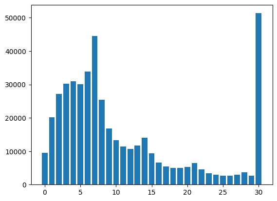
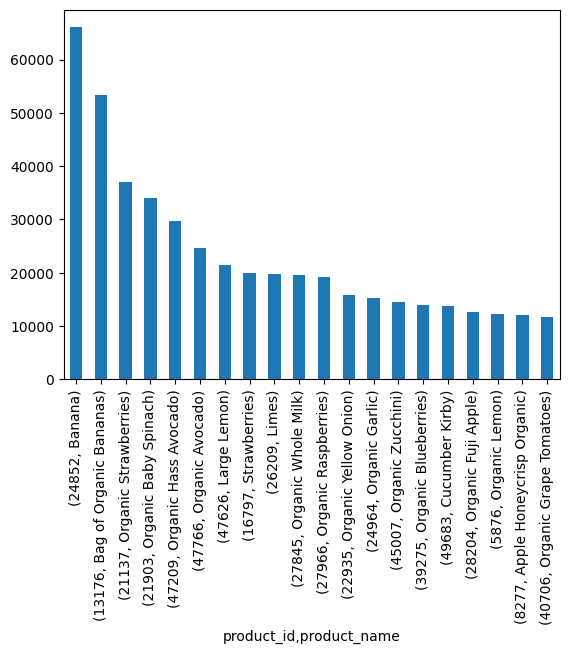

# 🛒 Sprint 2 — Instacart Market Basket Analysis

   

## Project Overview

This project performs an exploratory data analysis (EDA) of the **Instacart Online Grocery Shopping Dataset**, a real-world dataset of over 3 million grocery orders from more than 200,000 anonymized users. The goal is to clean the data, handle missing values and duplicates, and surface insights about customer shopping behavior.

---

## Datasets

Five interrelated CSV files, each separated by semicolons (`;`):

| File | Description |
|---|---|
| `instacart_orders.csv` | Order-level data: user, day/time, days since prior order |
| `products.csv` | Product catalog with aisle and department IDs |
| `departments.csv` | Department lookup table |
| `aisles.csv` | Aisle lookup table |
| `order_products.csv` | Line-item detail: which products were in each order |

---

## Data Cleaning Summary

| Issue | Dataset | Resolution |
|---|---|---|
| 1,258 missing `product_name` | `products` | Filled with `'unknown'` — all in aisle/dept "missing" |
| 28,819 missing `days_since_prior_order` | `orders` | Left as NaN — represents customers' first-ever order |
| 836 missing `add_to_cart_order` | `order_products` | Replaced with sentinel `999` — items placed 65th+ (beyond column capacity) |
| 15 duplicate rows | `orders` | Dropped — all at 2 AM on day 3 (likely system error) |
| 1,361 duplicate product names | `products` | Dropped case-insensitive duplicates, kept first |

---

## Analysis Highlights

### [A] Shopping Behavior
- **Peak hours:** Orders spike between 10 AM–3 PM
- **Peak days:** Sunday (0) and Monday (1) lead order volume
- **Reorder interval:** Most common gap is **7 days** (weekly shoppers); secondary peaks at 14, 21, 28 days

### [B] Customer Reorder Patterns
- Majority of customers have placed 1–10 orders total
- Most orders contain between 3–8 items
- Top 20 most-reordered products are dominated by fresh produce and dairy

### [C] Department-Level Insights
- **Produce** is the #1 department by order volume
- **Dairy & Eggs** and **Snacks** follow closely
- The distribution of items per department reveals clear staple vs. specialty categories

---

## Visualizations





---

## How to Run

> **Note:** Dataset paths reference the TripleTen learning platform (`/datasets/`). Cell outputs are preserved in the notebook for viewing without re-execution.

```bash
pip install pandas matplotlib
jupyter notebook notebook.ipynb
```

---

## Skills Demonstrated

`pandas` · `matplotlib` · multi-table data loading · missing value imputation · duplicate detection · sentinel value encoding · behavioral EDA · frequency analysis · data storytelling
