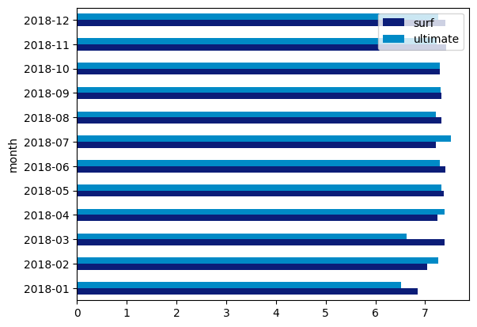
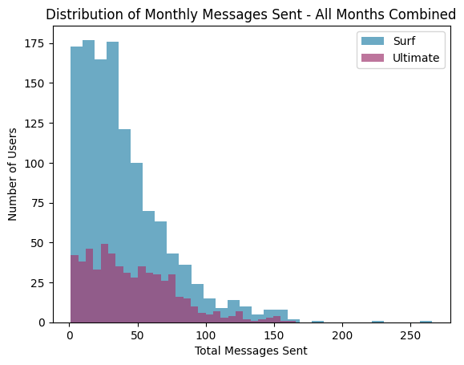
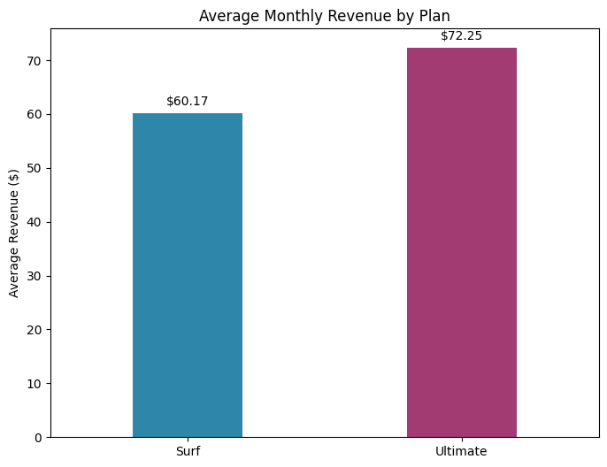

# 📊 Sprint 3 — Megaline Plan Statistical Analysis

   

## Project Overview

As an analyst for telecom operator **Megaline**, this project determines which of two prepaid plans — **Surf** or **Ultimate** — generates more revenue, to inform the commercial department's advertising budget allocation.

The analysis covers 500 customers across 5 datasets, applying descriptive statistics, usage aggregation, overage revenue modeling, and Welch's t-tests to draw data-driven business conclusions.

---

## Datasets

| File | Description |
|---|---|
| `megaline_users.csv` | User demographics, plan enrollment, registration/churn dates |
| `megaline_calls.csv` | Individual call records (user, date, duration in minutes) |
| `megaline_messages.csv` | Text message records (user, date) |
| `megaline_internet.csv` | Internet session records (user, date, MB used) |
| `megaline_plans.csv` | Plan conditions: included minutes, messages, GB, monthly fee, overage rates |

---

## Plan Conditions

| Plan | Monthly Fee | Included Minutes | Included Messages | Included GB | Overage Rates |
|---|---|---|---|---|---|
| **Surf** | $20 | 500 | 50 | 15 GB | $0.03/min · $0.03/msg · $10/GB |
| **Ultimate** | $70 | 3,000 | 1,000 | 30 GB | $0.01/min · $0.01/msg · $7/GB |

---

## Methodology

1. **Data Cleaning:** Converted date columns to `datetime`; rounded call durations up (`math.ceil`) per billing rules
2. **Aggregation:** Computed monthly totals per user for calls, messages, and internet usage
3. **Revenue Modeling:** Calculated monthly revenue = base fee + overage charges (when usage exceeds plan limits)
4. **Behavioral Analysis:** Compared usage distributions between plans using histograms and boxplots
5. **Hypothesis Testing:** Applied Welch's t-test (unequal variance) at α = 0.05

---

## Key Results

### Hypothesis 1: Plan Revenue Difference
> H₀: Average revenue from Ultimate = Surf · H₁: Differs

**→ Reject H₀.** Ultimate users generate significantly more revenue (~$12/month more on average). The p-value was below 0.05, confirming the difference is not due to chance.

### Hypothesis 2: NY-NJ vs. Other Regions
> H₀: NY-NJ revenue = Other regions · H₁: Differs

**→ Fail to reject H₀.** No statistically significant regional revenue difference found. Geographic location does not predict revenue.

---

## Visualizations





---

## How to Run

> **Note:** Dataset paths reference the TripleTen learning platform (`/datasets/`). Cell outputs are preserved for viewing without re-execution.

```bash
pip install pandas numpy matplotlib seaborn scipy
jupyter notebook notebook.ipynb
```

---

## Skills Demonstrated

`pandas` · `numpy` · `scipy.stats` · `matplotlib` · `seaborn` · data aggregation · overage revenue modeling · Welch's t-test · hypothesis formulation · statistical significance · business insight communication
