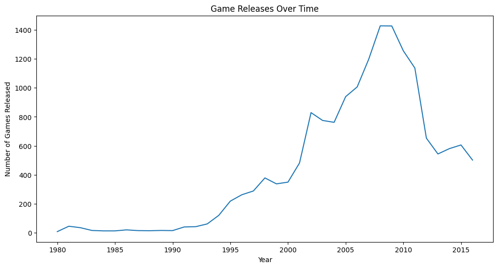
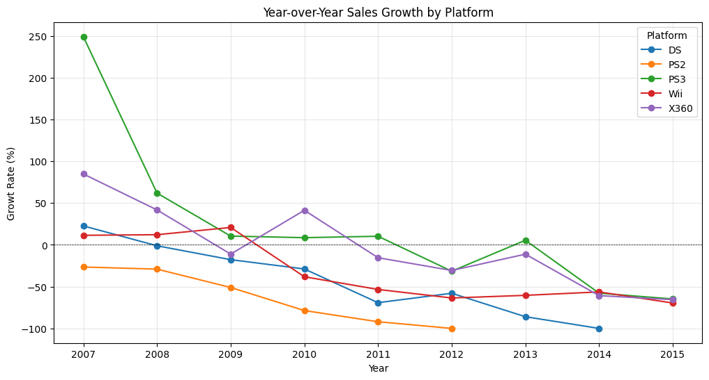
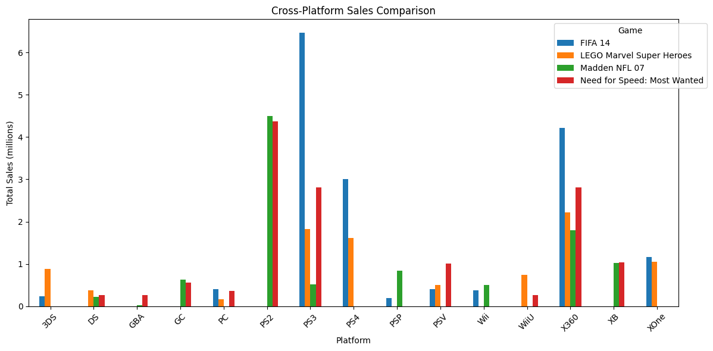

# 🎮 Sprint 5 — Video Game Sales Analysis

    

## Project Overview

Working as an analyst for the online game store **Ice**, this project analyzes historical video game sales data (1980–2016) to identify patterns that determine commercial success. The findings inform the store's **2017 advertising campaign** by surfacing the most promising platforms, genres, and regional markets.

---

## Dataset

**`games.csv`** — 16,715 records across 11 columns:

| Column | Description |
|---|---|
| `name` | Game title |
| `platform` | Console/platform (PS3, X360, Wii, PC, etc.) |
| `year_of_release` | Year the game was published |
| `genre` | Game genre (Action, Sports, RPG, etc.) |
| `na_sales` | North America sales (millions) |
| `eu_sales` | Europe sales (millions) |
| `jp_sales` | Japan sales (millions) |
| `other_sales` | All other regions (millions) |
| `critic_score` | Metacritic score (0–100) |
| `user_score` | User score (0–10) |
| `rating` | ESRB rating (E, T, M, etc.) |

---

## Methodology

1. **Data Cleaning:** Lowercased columns; converted `year_of_release` and `user_score` to numeric; treated `'tbd'` as NaN
2. **Feature Engineering:** Calculated `total_sales` across all four regions
3. **Temporal Analysis:** Identified peak release years and platform lifecycle windows
4. **Relevant Period Selection:** Focused on 2004–2014 to capture the modern console generation
5. **Regional Profiling:** Built user profiles for NA, EU, and JP markets by platform, genre, and ESRB rating
6. **Hypothesis Testing:** Applied Welch's t-test (α = 0.05) on user rating data

---

## Key Findings

### Platform Lifecycle
- Platform lifecycles average **5–8 years**, closely mirroring console generation cycles
- **PS3, X360, and Wii** dominated the 2004–2014 relevant window
- **PC** was the only platform with positive growth (+40.6%); all consoles declined post-2011

### Regional Profiles

| Region | Top Platform | Top Genre | ESRB Sensitivity |
|---|---|---|---|
| NA | Xbox 360 | Action / Sports | High (M-rated dominates) |
| EU | PS3 | Action / Sports | High (M-rated dominates) |
| JP | 3DS / DS | Role-Playing | Low |

### Genre Market Share
Action (~20%) → Sports → Shooter → Role-Playing → Platform → Misc

### Hypothesis Tests

| Test | Result |
|---|---|
| Xbox One vs. PC user ratings | **Reject H₀** — ratings differ significantly |
| Action vs. Sports user ratings | **Reject H₀** — ratings differ significantly |

---

## Visualizations






---

## How to Run

> **Note:** Dataset paths reference the TripleTen learning platform (`/datasets/`). Cell outputs are preserved for viewing without re-execution.

```bash
pip install pandas matplotlib seaborn scipy
jupyter notebook notebook.ipynb
```

---

## Skills Demonstrated

`pandas` · `matplotlib` · `seaborn` · `scipy.stats` · platform lifecycle analysis · regional market profiling · ESRB impact analysis · cross-platform game comparison · Welch's t-test · hypothesis testing · data storytelling
