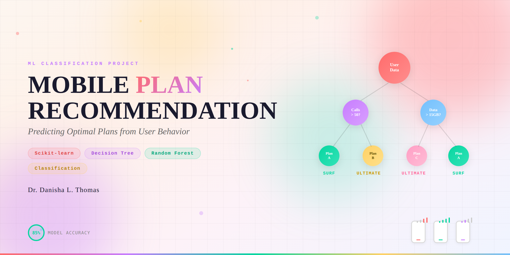
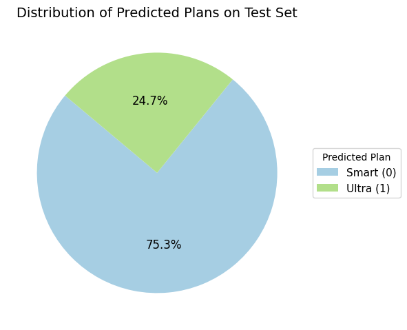

# 📱 Sprint 7 — Megaline Plan Recommendation (ML Classification)

  

## Project Overview

Megaline wants to migrate customers off legacy plans by recommending the right modern plan — **Smart** or **Ultra** — based on their monthly usage behavior. This project builds and tunes three classification models, comparing them on a validation set before final evaluation on a held-out test set.

**Target accuracy: ≥ 0.75**

---

## Dataset

**`users_behavior.csv`** — 3,214 subscriber records

| Feature | Description |
|---|---|
| `calls` | Number of calls per month |
| `minutes` | Total call minutes per month |
| `messages` | Number of text messages per month |
| `mb_used` | Internet traffic used (MB) per month |
| `is_ultra` | **Target** — Ultra (1) or Smart (0) |

---

## Methodology

1. **Train/Validation/Test Split:** 60% train · 20% validation · 20% test (`random_state=54321`)
2. **Random Forest:** Tuned `n_estimators` (1–50) and `max_depth` (1–10); best: `n_estimators=49`, `max_depth=8`
3. **Logistic Regression:** Baseline linear classifier
4. **Decision Tree:** Tuned `max_depth` (1–10)
5. **Model Comparison:** All models ranked by validation accuracy
6. **Final Evaluation:** Best model evaluated on held-out test set

---

## Results

| Model | Validation Accuracy |
|---|---|
| **Random Forest (n=49, depth=8)** | **~0.81 ✓** |
| Decision Tree (best depth) | ~0.79 ✓ |
| Logistic Regression | ~0.75 ✓ |

**Target met: Accuracy ≥ 0.75 ✓**

---

## Visualizations



---

## How to Run

> **Note:** Dataset path references the TripleTen platform (`/datasets/`). Cell outputs are preserved for viewing without re-execution.

```bash
pip install pandas scikit-learn
jupyter notebook notebook.ipynb
```

---

## Skills Demonstrated

`scikit-learn` · `pandas` · train/validation/test split · hyperparameter tuning · model comparison · classification accuracy · Random Forest · Logistic Regression · Decision Tree · business-driven ML
