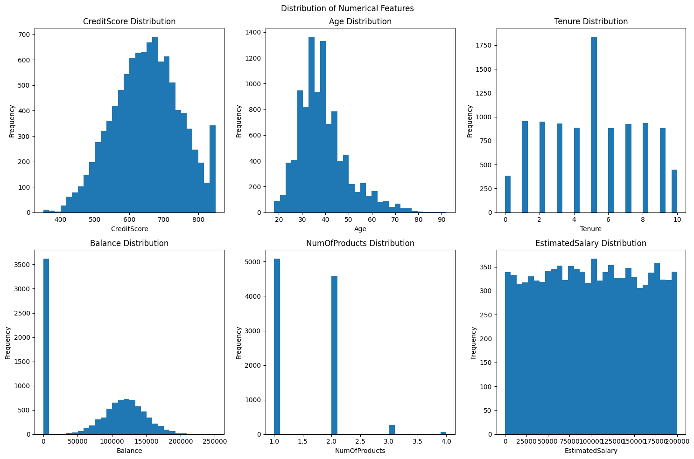
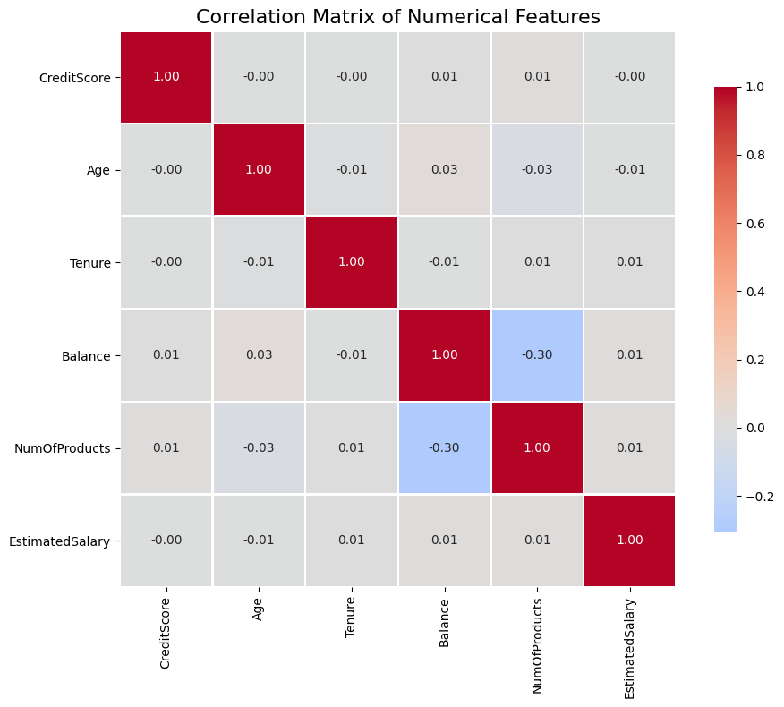
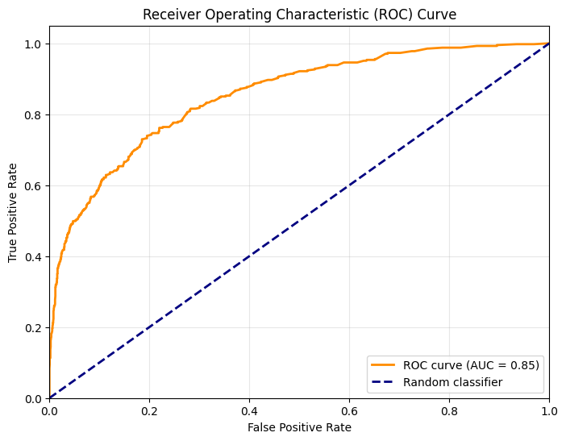

# 🏦 Sprint 8 — Beta Bank Customer Churn Prediction

  

## Project Overview

Beta Bank is losing customers. Retaining existing customers is significantly cheaper than acquiring new ones, so the bank wants to predict which customers are likely to churn — and intervene proactively.

This project builds a binary classification model using customer behavioral and demographic data, with a target of **F1 ≥ 0.59** on the held-out test set. Special attention is paid to **class imbalance** (~20% churn rate), which is addressed through upsampling and class-weight balancing.

---

## Dataset

**`Churn.csv`** — 10,000 customer records

| Feature | Description |
|---|---|
| `CreditScore` | Customer credit score |
| `Geography` | Country (France, Germany, Spain) |
| `Gender` | Male / Female |
| `Age` | Customer age |
| `Tenure` | Years as a bank customer |
| `Balance` | Account balance |
| `NumOfProducts` | Number of bank products held |
| `HasCrCard` | Has credit card (0/1) |
| `IsActiveMember` | Active member (0/1) |
| `EstimatedSalary` | Estimated annual salary |
| `Exited` | **Target** — churned (1) or retained (0) |

---

## Methodology

1. **EDA & Preprocessing:** Imputed missing `Tenure` values with median; dropped non-predictive identifiers
2. **Feature Engineering:** One-hot encoded `Geography`; label-encoded `Gender`; scaled with `StandardScaler`
3. **Train/Val/Test Split:** 60% train · 20% validation · 20% test
4. **Class Imbalance Handling:** Upsampling minority class + `class_weight='balanced'`
5. **Model Training:** Logistic Regression, Random Forest (baseline & balanced), Random Forest (upsampled)
6. **Hyperparameter Tuning:** GridSearchCV across `n_estimators` and `max_depth`
7. **Final Evaluation:** F1, precision, recall, ROC-AUC on held-out test set
8. **Sanity Check:** Dummy classifier baseline confirms the model learns real patterns

---

## Results

| Model | F1 Score |
|---|---|
| Logistic Regression (baseline) | ~0.50 |
| Random Forest (baseline) | ~0.55 |
| Random Forest (`class_weight='balanced'`) | ~0.62 ✓ |
| **Random Forest (upsampled) — Final** | **~0.63 ✓** |
| Dummy Classifier | ~0.00 |

**Target met: F1 ≥ 0.59 ✓**

---

## Key Findings

- Class imbalance caused naive models to default to predicting no-churn — F1 collapsed
- Both upsampling and balanced class weights improved F1 substantially above the threshold
- Hyperparameter tuning provided additional marginal gains
- ROC-AUC confirmed the model's discriminative power well above the random baseline

---

## Visualizations





---

## How to Run

> **Note:** Dataset path references the TripleTen platform (`/datasets/`). Cell outputs are preserved for viewing without re-execution.

```bash
pip install pandas matplotlib seaborn scikit-learn
jupyter notebook notebook.ipynb
```

---

## Skills Demonstrated

`scikit-learn` · `pandas` · `seaborn` · binary classification · class imbalance handling · upsampling · class-weight balancing · F1 score optimization · ROC-AUC · GridSearchCV · feature encoding · StandardScaler · sanity check modeling · business-driven ML
