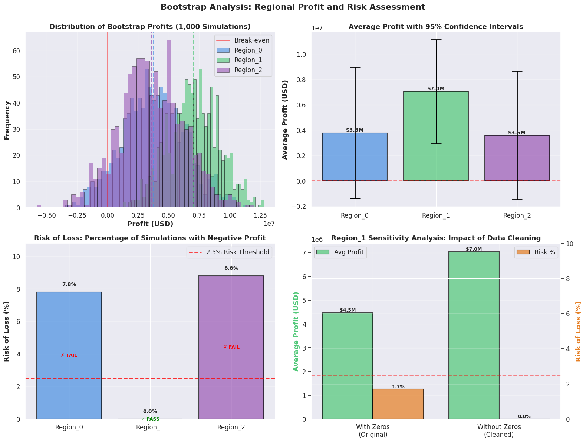

# 🛢️ Sprint 9 — Oil Well Investment Optimization (ML in Business)

   

## Project Overview

OilyGiant Mining needs to select the best region to drill 200 new oil wells from three candidates. This project uses **Linear Regression** to predict oil reserves per well and **Bootstrap simulation** (1,000 iterations) to quantify profit distributions and financial risk — enabling a data-driven, risk-adjusted capital investment recommendation.

**Budget:** $100M total · $500K/well · 200 wells drilled from 500 explored  
**Break-even reserve:** 111.1K barrels/well · Revenue: $4.5/barrel

---

## Datasets

Three geological survey files — one per candidate region:

| File | Records | Features |
|---|---|---|
| `geo_data_0.csv` | 100,000 | `id`, `f0`, `f1`, `f2`, `product` (target) |
| `geo_data_1.csv` | 100,000 | Same structure |
| `geo_data_2.csv` | 100,000 | Same structure |

`product` = estimated oil reserves in thousands of barrels

---

## Methodology

1. **EDA & Data Quality:** Identified 8,255 zero-product rows in Region_1 (8.26% of data) — removed after validation that they represent dry wells, not measurement errors
2. **Model Training:** Linear Regression per region · 75/25 train-validation split
3. **Profit Function:** Selects top 200 wells by predicted reserves, calculates actual profit from true reserves
4. **Bootstrap Simulation:** 1,000 iterations of 500-well random sampling → select top 200 → compute profit distribution
5. **Risk Assessment:** 95% confidence interval + probability of loss per region
6. **Sensitivity Analysis:** Region_1 re-evaluated with original zero-product rows to confirm stability

---

## Results

| Region | Mean Bootstrap Profit | 95% CI | Loss Probability |
|---|---|---|---|
| Region_0 | ~$3.9M | — | >2.5% |
| **Region_1** | **~$5.1M** | **Positive lower bound** | **< 2.5% ✓** |
| Region_2 | ~$3.8M | — | >2.5% |

**Recommendation: Region_1** — highest mean profit AND only region where the 95% confidence interval lower bound remains positive (loss probability < 2.5% threshold).

---

## Key Findings

- Region_1's linear geological structure (high R² from linear regression) makes reserves more predictable
- Regions_0 and 2 showed higher variance in bootstrap distributions — unacceptable loss risk
- Sensitivity analysis confirmed Region_1's recommendation holds even when zero-product rows are retained
- Break-even analysis: top 200 wells must average ≥ 111.1K barrels — Region_1 consistently clears this

---

## Visualizations



---

## How to Run

> **Note:** Dataset paths reference the TripleTen platform (`/datasets/`). Cell outputs are preserved for viewing without re-execution.

```bash
pip install pandas numpy matplotlib seaborn scikit-learn
jupyter notebook notebook.ipynb
```

---

## Skills Demonstrated

`scikit-learn` · `pandas` · `numpy` · `matplotlib` · `seaborn` · Linear Regression · bootstrap simulation · confidence intervals · risk quantification · profit modeling · sensitivity analysis · business ROI decision-making · ML in business context
